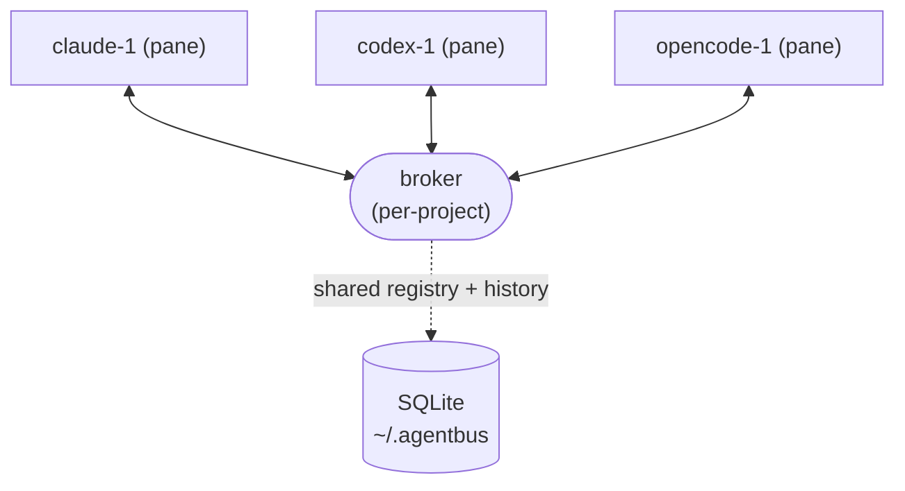
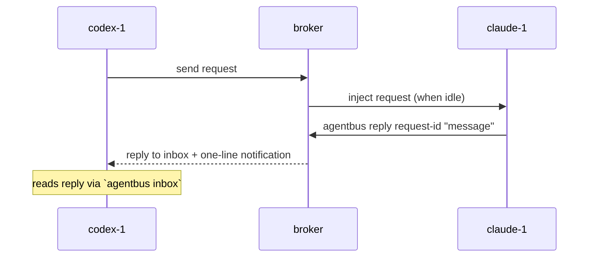

# agentbus

**A local multi-agent message bus for AI coding agents.**

agentbus lets any running AI coding agent (Claude Code, Codex, opencode, …) send
and receive messages from any *other* running agent on the same machine, in real
time. Each agent lives in its own terminal pane; agentbus routes a **request**
from one agent into another's pane, waits for it to finish, and delivers the
**reply** back — all through a lightweight local broker and your terminal
multiplexer (tmux or [herdr](https://github.com/tk-425/herdr)).

---

## Why

When you run several coding agents side by side, coordinating them is manual:
you copy output from one pane and paste it into another. agentbus automates that
hand-off. One agent can ask another a question or delegate a task, and get the
answer back — without you brokering every exchange by hand.

The design keeps the two agents from looping: a **request** is injected into the
target's pane and acted on, but its **reply** is *never* injected — it lands in
the requester's inbox, and only a one-line notification is shown in the pane. The
requester reads the reply on its own terms via `agentbus inbox`.

---

## How it works

Any registered agent can send a request to any other; the broker routes them and
returns each reply to the sender's inbox:



Each link carries requests *out* to a target pane (injected when that agent is
idle) and replies *back* to the sender's inbox. For a single exchange:



- A **broker** runs per project on a dynamic local port (starting at `7373`).
- The broker discovers agent panes automatically and keeps a shared registry.
- Each registered agent gets a **watcher** that injects queued requests when the
  agent is **idle** and announces newly arrived replies to the requester.
- State (brokers, agents, message history) is stored in a shared SQLite database.

---

## Requirements

- [tmux](https://github.com/tmux/tmux) **or** [herdr](https://github.com/tk-425/herdr)
  (the backend is selected from the current pane's runtime environment — tmux
  inside a tmux pane, herdr inside a herdr pane; agentbus exits with an actionable
  message when run outside both)
- Go 1.26+ (to build from source)

---

## Install

### Prebuilt binary (recommended)

Download a prebuilt archive for your platform from the
[GitHub Releases](https://github.com/tk-425/Agentbus/releases) page — no Go
toolchain required. Archives are published for macOS and Linux on both `amd64`
and `arm64`.

```bash
# Pick the archive matching your OS/arch, e.g. macOS arm64:
tar -xzf agentbus_*_darwin_arm64.tar.gz         # extract the agentbus binary
sudo mv agentbus /usr/local/bin/agentbus        # put it on your PATH
agentbus version                                # confirm the installed version
```

Each release also ships a `checksums.txt`; verify your download against it
before extracting (e.g. `sha256sum -c checksums.txt`).

### Build from source

Requires Go 1.26+. Build and install the binary to `/usr/local/bin`:

```bash
make install       # builds ./agentbus and moves it to /usr/local/bin/agentbus
```

Other Makefile targets:

```bash
make build         # compile the binary to ./agentbus (version from `git describe`)
make uninstall     # remove /usr/local/bin/agentbus
```

A source build embeds a `git describe`-derived development version, so
`agentbus version` reflects the exact commit it was built from.

---

## Releasing

Releases are automated with [GoReleaser](https://goreleaser.com/): cutting a
release is just pushing a semver tag.

```bash
git tag v0.5.0
git push --tags
```

The pushed tag triggers the `release` GitHub Actions workflow, which runs
GoReleaser to cross-compile the macOS/Linux × amd64/arm64 archives, generate a
`checksums.txt`, build changelog notes from the conventional-commit history, and
publish them all as a GitHub Release. The tag is the single source of truth for
the released version — it is injected at build time, with no manual version edit
required to cut a release.

---

## Quickstart

Run each agent in its own tmux/herdr pane inside the same project directory, then:

```bash
# 1. Start the broker from inside the project directory you want to coordinate.
#    The broker is per-project (keyed to the current directory) — it only
#    discovers panes whose working directory is inside this project.
agentbus start

# 2. See who's registered
agentbus list
#   claude-1@myproject
#   codex-1@myproject

# 3. Learn the sender's own instance name
agentbus whoami
#   codex-1

# 4. Have one agent send a request to another
agentbus send --from codex-1 --to claude-1 "Review internal/broker/routing.go for races"

# 5. In the recipient pane, finish by running the injected reply command
agentbus reply abc123 "No race found; queue access is serialized."

# 6. The requester reads the reply from its inbox
agentbus inbox --name codex-1
#   [reply] from claude-1: No race found; queue access is serialized.
```

Agents can also register themselves explicitly if auto-discovery doesn't pick
them up:

```bash
agentbus register --name claude      # registers the current pane (auto-suffixes to claude-1, claude-2, …)
agentbus whoami                      # prints this pane's instance name
```

---

## Natural-language skill

The commands below are the low-level interface. You don't have to type them
yourself — agentbus ships a **skill** (`Skill/agentbus/`) that teaches an AI
coding agent the whole request/reply workflow, so you can coordinate agents in
plain language and let the agent run the right commands for you:

> *"Ask the codex agent to run the tests in ./api and report pass/fail."*

Agents in **other projects** work too — just name the project ("from
Project-1", "in Project-1") and the agent scopes across all of them:

> *"Ask the codex agent from Project-1 to run its unit tests and report only
> pass/fail."*

The agent resolves its own name (`agentbus whoami`), finds the target
(`agentbus list`, or `agentbus list --all` when another project is named), sends
the request — using the fully qualified `codex-1@Project-1` for a cross-project
target — and later reads the reply from its inbox when the `[agentbus] new reply
…` notification lands — the same steps shown in the Quickstart, driven for you.

**Install it** by copying the skill into your agent's skills directory. The
location depends on the agent; for Claude Code:

```bash
# user-wide
cp -R Skill/agentbus ~/.claude/skills/agentbus

# or per-project
cp -R Skill/agentbus .claude/skills/agentbus
```

The skill is distributed with the source but isn't part of the compiled binary,
so `make install` does not install it — copy it separately as above.

---

## Commands

| Command | Description |
| --- | --- |
| `agentbus start` | Start the broker for the **current project** (run it from inside that directory); auto-discovers agents whose CWD is in the project. Idempotent per project. |
| `agentbus stop` | Stop the broker for the current project. |
| `agentbus register --name <type> [--pane <id>]` | Register the current pane as an agent, or register an explicit pane ID with `--pane` (auto-suffixes if the name is taken). |
| `agentbus unregister --name <inst>` | Remove an agent instance from the registry. |
| `agentbus whoami` | Print the instance name registered for the current pane. |
| `agentbus send --from <inst> --to <inst> <message>` | Send a request; the reply routes back to `--from`. |
| `agentbus reply <request-id> <message>` | Answer a received request; routes the terminal reply back to the original requester. |
| `agentbus inbox --name <inst> [--wait] [--timeout <dur>]` | Read pending messages (marks them read). `--wait` blocks until one arrives. |
| `agentbus list [--all]` | List registered agent instances (`name@project`). Use `--all` to include every project instead of only the current one. |
| `agentbus status` | Print statusline data (broker up/down, agent count, history, version). |
| `agentbus log` | Show recent message history. |
| `agentbus discover` | Scan panes and register agents whose CWD is inside the project. |
| `agentbus add-agent --name <type> [--prompt-pattern <regex>] [--response-wait <seconds>]` | Add a custom agent type to `agents.json`, optionally setting its prompt pattern and response wait. |
| `agentbus version` | Print the agentbus version. |

Run `agentbus <command> --help` for full flags.

---

## Runtime files

All runtime state lives under `~/.agentbus/`:

```
~/.agentbus/
├── config.json       # global user config (multiplexer preference, etc.)
├── agentbus.db       # SQLite DB — brokers, agents, messages
├── agents.json       # agent type definitions (prompt_pattern, response_wait)
├── port              # current broker port
└── logs/
    └── <project>.log # per-project broker log
```

---

## Key behaviors

- The broker runs on a dynamic port starting at `7373`; the chosen port is
  written to `~/.agentbus/port`.
- `agentbus start` runs continuous auto-discovery — immediately on startup, then
  reconciling on an interval — and is idempotent: a second start in the same
  project reports the live broker instead of launching another.
- Watchers run inside the broker process and are restarted with the broker.
- `agentbus inbox` returns immediately by default; pass `--wait` for scripted use.
- Reply arrival is announced by injecting a one-time notification into the
  requester's pane while it's idle. Reply *bodies* are never injected — agents
  read them via `agentbus inbox`.
- Recipients return answers explicitly with `agentbus reply <request-id> <message>`;
  watchers no longer scrape pane output to build replies.
- Message responses are hard-truncated at 32 KB; pass file paths for large
  content.
- Instance names are never reused within a broker session.

---

## Project layout

```
main.go              # entry point — calls cmd.Execute()
cmd/
├── root.go          # root cobra command, broker process, watcher supervision
└── commands.go      # all subcommands
internal/
├── agenttypes/      # agent type definitions (agents.json)
├── broker/          # broker, routing, request queue, handlers
├── client/          # in-process + network client
├── db/              # SQLite schema and access
├── message/         # message model
├── multiplexer/     # tmux + herdr backends, auto-detection
├── registry/        # shared agent registry
├── version/         # version string
└── watcher/         # per-agent request delivery / reply notifications
Skill/agentbus/      # natural-language skill (distributed separately)
Makefile
```

---

## Tech stack

- **Go** with [cobra](https://github.com/spf13/cobra) for the CLI
- **SQLite** via [`modernc.org/sqlite`](https://pkg.go.dev/modernc.org/sqlite)
  (pure Go, no CGo)
- **tmux** and **herdr** multiplexer backends
- Released with [GoReleaser](https://goreleaser.com/)
